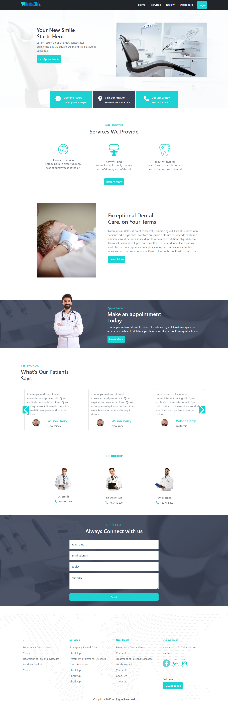

# **Dental-Clinic**
### `Website Link :` 

## About & Features

- **Dental-Clinic** is a MERN STACK web app with dashboard where people can pick the date and time and fix an appointment. The website front-end is built with React, Firebase, React-Router and React-Bootstrap And has been used Authentication of Firebase . back-end is built with node, express, and mongodb database. 
- If user click on the appointment button, user will be taken to the login page for Sign up or Sign in to view the appointment from . Then user must be Sign up and Login to view the appointment from.
-  In review page user can see her all booking appointment and user can cancel appointment the booking list.
- website dashboard only admin can access and after access to dashboard admin can added new services, take a action delete or updated service, service status can change and create a new admin.
- The website dashboard can be checked bu anyone using the test email and password .
- The website data is dynamically loaded from the mongoDB database.
- The website is dynamically change route with url.

### Front-end Technology Used : 
- **React, React-Router-Dom,**
- **React-Bootstrap-5**
- **CSS3**
- **Firebase Authentication**

### Back-end Technology Used : 
- **node.js**
- **express**
- **mongoDB**

 [Back-end Repository](https://github.com/shakil232/Modern-Dental-Clinic-Server)

